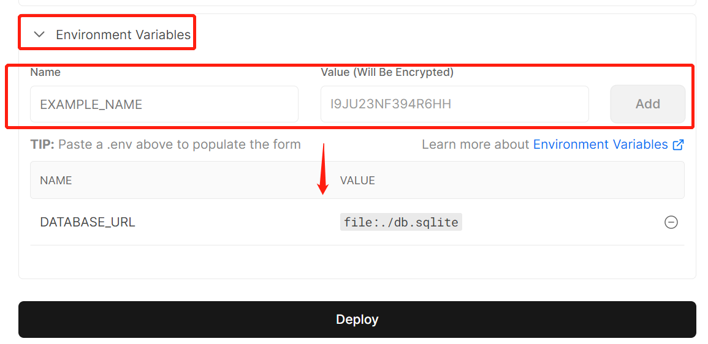
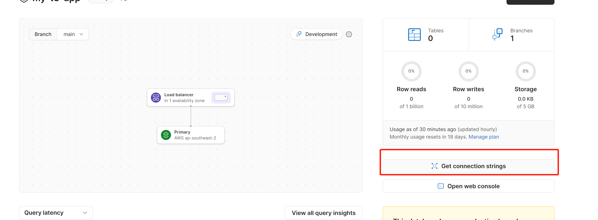
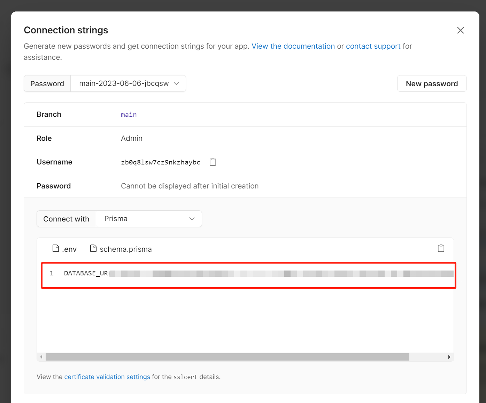
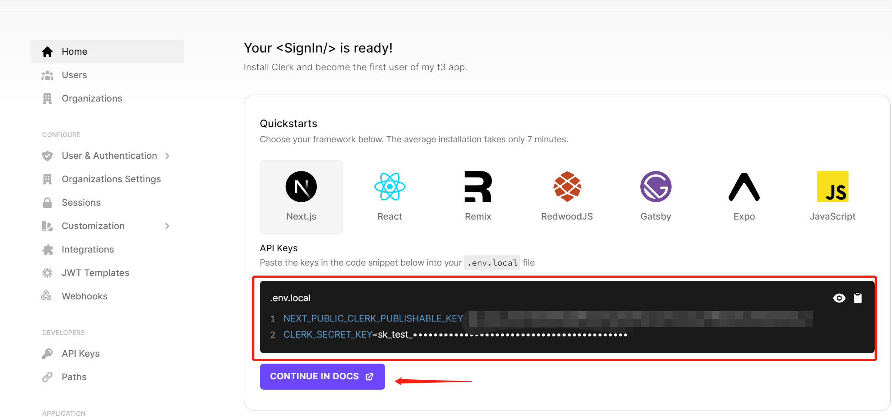
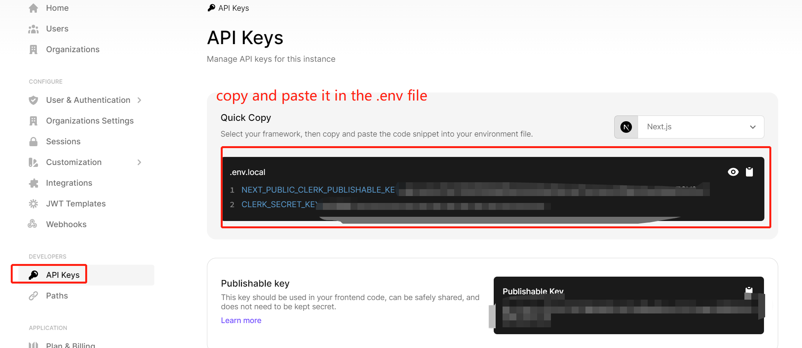
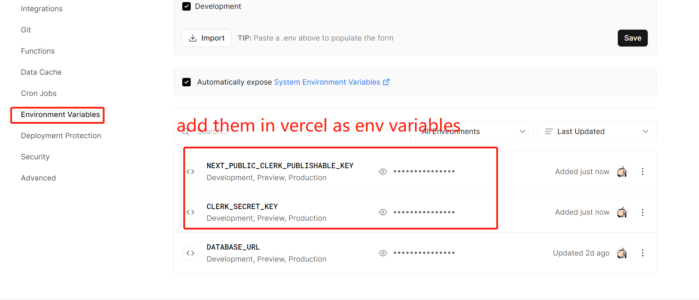

(ctrl + shift + P, then input Markdown All in One: Create Table of Contents press Enter to create markdown category)

# Create T3 App

This is a [T3 Stack](https://create.t3.gg/) project bootstrapped with `create-t3-app`.

## What's next? How do I make an app with this?

We try to keep this project as simple as possible, so you can start with just the scaffolding we set up for you, and add additional things later when they become necessary.

If you are not familiar with the different technologies used in this project, please refer to the respective docs. If you still are in the wind, please join our [Discord](https://t3.gg/discord) and ask for help.

- [Next.js](https://nextjs.org)
- [NextAuth.js](https://next-auth.js.org)
- [Prisma](https://prisma.io)
- [Tailwind CSS](https://tailwindcss.com)
- [tRPC](https://trpc.io)

## Learn More

To learn more about the [T3 Stack](https://create.t3.gg/), take a look at the following resources:

- [Documentation](https://create.t3.gg/)
- [Learn the T3 Stack](https://create.t3.gg/en/faq#what-learning-resources-are-currently-available) — Check out these awesome tutorials

You can check out the [create-t3-app GitHub repository](https://github.com/t3-oss/create-t3-app) — your feedback and contributions are welcome!

## How do I deploy this?

Follow our deployment guides for [Vercel](https://create.t3.gg/en/deployment/vercel), [Netlify](https://create.t3.gg/en/deployment/netlify) and [Docker](https://create.t3.gg/en/deployment/docker) for more information.

---

## Study Log

### Day 1 Setting up project

Set up my own t3 app:

1. Create a repo named my-t3-project on github
2. Clone the project in local
3. Open the terminal under the project folder and run the command blow:
   - npx create-t3-app@latest
   - give the project a name(my-t3-app)
   - choose ts, then prisma, tailwind and trpc
   - choose yes for all the other qustions
   - cd my-t3-project
   - code . to open vscode
4. push the code to github

### Day 2 Setting up github, vercel, and planetscale

- go to vercel.com click import project, then choose the project you want to deploy, then copy the database URL line in the .env file and paste it in the space below the Environment variables, then click deploy button.
  

- create database in planetscale.com, replaced the DATABASE_URL content in .env file
  
  

- google search planetscale prisma then go to
  https://planetscale.com/docs/prisma/prisma-quickstart
  find the code below and replaced the code in front of the model Example in schema.prisma file:

```
datasource db {
  provider = "mysql"
  url      = env("DATABASE_URL")
  relationMode = "prisma"
}

generator client {
  provider = "prisma-client-js"
}
```

- because we don't have create anything in our database, so run

```
npx prisma db push
npx prisma studio
```

### Day 3 ClerkProvider and middleware

Add clerk environment settings

- go to clerk.com
- create a new application
- click inside, then follow the docs
  

```
npm install @clerk/nextjs
```

- 
- 
- add ClerkProvider in src\pages_app.tsx
  https://clerk.com/docs/nextjs/get-started-with-nextjs

```
// page/_app.tsx
import { ClerkProvider } from "@clerk/nextjs";
import type { AppProps } from "next/app";

function MyApp({ Component, pageProps }: AppProps) {
  return (
    <ClerkProvider {...pageProps}>
      <Component {...pageProps} />
    </ClerkProvider>
  );
}

export default MyApp;
```

- Then create middleware.ts file under the src folder, add middleware to protect the application, use it to decide which pages can be public viewed, which can not.

```
middleware.ts
import { authMiddleware } from "@clerk/nextjs";

export default authMiddleware();

export const config = {
  matcher: ["/((?!.*\\..*|_next).*)", "/", "/(api|trpc)(.*)"],
};
```

### Day 4 Sign in and Sign out

src\pages\index.tsx

```js
import { SignIn, SignInButton, SignOutButton, useUser } from "@clerk/nextjs";
import { type NextPage } from "next";
import Head from "next/head";
import Link from "next/link";
import { api } from "~/utils/api";

const Home: NextPage = () => {
  const hello = api.example.hello.useQuery({ text: "from tRPC" });
  const user = useUser();

  return (
    <>
      <Head>
        <title>Create T3 App</title>
        <meta name="description" content="Generated by create-t3-app" />
        <link rel="icon" href="/favicon.ico" />
      </Head>
      <main className="flex min-h-screen flex-col items-center justify-center bg-gradient-to-b from-[#2e026d] to-[#15162c]">
        <div>
          {!user.isSignedIn && <SignInButton />}
          {!!user.isSignedIn && <SignOutButton />}
        </div>
        <SignIn />
      </main>
    </>
  );
};

export default Home;
```

### Day 5 redefine db and show the first post after sign in

- go to Axiom, link with github account and connected with t3 project
- come back to vercel project integrations, search axiom and add t3 project.
- modify prisma file to redefine database
  prisma\schema.prisma

```sql
// This is your Prisma schema file,
// learn more about it in the docs: https://pris.ly/d/prisma-schema

datasource db {
  provider = "mysql"
  url      = env("DATABASE_URL")
  relationMode = "prisma"
}

generator client {
  provider = "prisma-client-js"
}

model Post {
    id        String   @id @default(cuid())
    createdAt DateTime @default(now())
    content   String   @db.VarChar(255)
    authorId  String
    @@index([authorId])
}
```

- run commands tp refresh the database

```bash
npx prisma db push
npm install
```

- If get error after run npx prisma db push, maybe try to delete nodemodules and npm install again, then run npm install npm install @prisma/client manually. After that, run npx prisma db push again will be successful.

- create posts.ts file under the src\server\api\routers, delete example.ts file and inside posts.ts:

```ts
import { z } from "zod";
import { createTRPCRouter, publicProcedure } from "~/server/api/trpc";

export const postsRouter = createTRPCRouter({
  getAll: publicProcedure.query(({ ctx }) => {
    return ctx.prisma.post.findMany();
  }),
});
```

- And the root.ts should be:

```ts
import { postsRouter } from "~/server/api/routers/posts";
import { createTRPCRouter } from "~/server/api/trpc";

/**
 * This is the primary router for your server.
 *
 * All routers added in /api/routers should be manually added here.
 */
export const appRouter = createTRPCRouter({
  posts: postsRouter,
});

// export type definition of API
export type AppRouter = typeof appRouter;
```

- modify the src\pages\index.tsx file

```js
import { SignIn, SignInButton, SignOutButton, useUser } from "@clerk/nextjs";
import { type NextPage } from "next";
import Head from "next/head";
import Link from "next/link";
import { api } from "~/utils/api";

const Home: NextPage = () => {
  const user = useUser();
  const { data } = api.posts.getAll.useQuery();
  return (
    <>
      <Head>
        <title>Create T3 App</title>
        <meta name="description" content="Generated by create-t3-app" />
        <link rel="icon" href="/favicon.ico" />
      </Head>
      <main className="flex min-h-screen flex-col items-center justify-center bg-gradient-to-b from-[#2e026d] to-[#15162c]">
        <div>
          {!user.isSignedIn && <SignInButton />}
          {!!user.isSignedIn && <SignOutButton />}
        </div>
        <div>
          {data?.map((post) => (
            <div key={post.id}>{post.content}</div>
          ))}
        </div>
      </main>
    </>
  );
};

export default Home;
```

- run commands npx prisma studio

then add recods and save in the webpage

---
